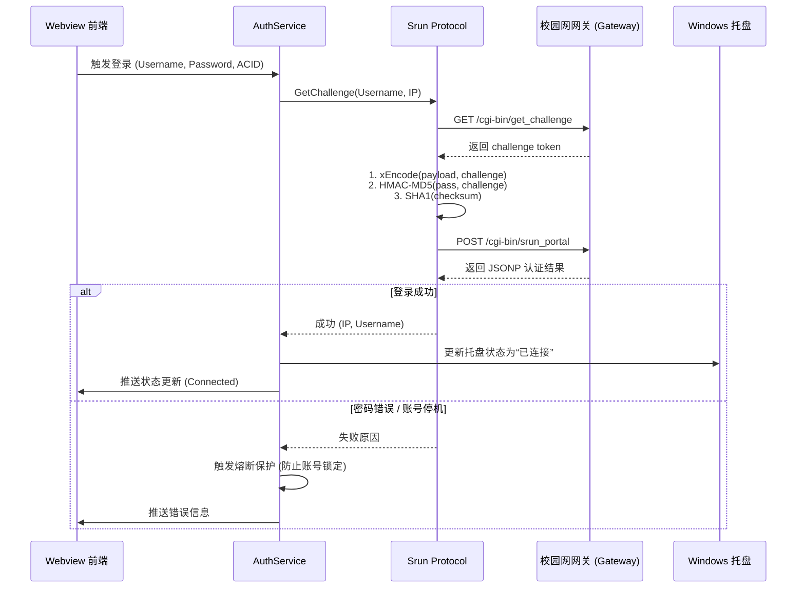

# srun-go 开发者接手与工程架构全景文档 (Handover & Architecture Guide)

本文档面向后续维护者、接手开发者及 AI 结对助手，全面梳理 `srun-go` 的**系统架构、协议细节、底层依赖、安全机制、编译打包与运维排障**，确保任何人均可平滑接手并在其基础上继续迭代。

---

## 目录
1. [项目定位与技术选型](#1-项目定位与技术选型)
2. [代码目录与模块导航](#2-代码目录与模块导航)
3. [核心业务时序与数据流](#3-核心业务时序与数据流)
4. [Srun 认证协议与加密原理](#4-srun-认证协议与加密原理)
5. [Windows 底层原生集成机制](#5-windows-底层原生集成机制)
6. [配置存储与凭证安全体系](#6-配置存储与凭证安全体系)
7. [本地开发、调试与编译指南](#7-本地开发调试与编译指南)
8. [GitHub CI/CD 与发版工作流](#8-github-cicd-与发版工作流)
9. [未来演进建议与已知要点](#9-未来演进建议与已知要点)

---

## 1. 项目定位与技术选型

### 1.1 业务定位
`srun-go` 专为深澜校园网认证系统（Srun 3k/4k Gateway）研发，解决高校环境下频繁掉线、手动打开网页繁琐、休眠唤醒无法重连以及明文密码存储不安全等痛点，提供**“无感保活、毫秒重连、极低资源占用、单文件绿色便携”**的 Windows 客户端。

### 1.2 技术栈全景
- **开发语言**：Go 1.24+（纯原生协程并发，静态编译）
- **前端 GUI 渲染**：`go-webview2`（调用 Windows 10/11 自带的 Microsoft Edge WebView2 运行时，零内存膨胀）
- **Win32 API 原生互操作**：
  - `user32.dll`：无边框窗口拖拽 (`ReleaseCapture`, `SendMessageW`)、DPI 动态缩放感知、系统托盘常驻。
  - `dwmapi.dll`：Windows 11 原生圆角、DWM 投影与暗黑模式适配。
  - `crypt32.dll`：Windows 原生 **DPAPI** 数据保护接口，与用户 Windows 登录凭据强绑定。
- **构建环境**：完全隔离于 `D:\Environment` 便携工具链，系统 C 盘 0 污染。

---

## 2. 代码目录与模块导航

```text
E:\VibeCoding\Project\srun-go\
├── cmd/
│   └── srun/
│       ├── main.go                     # 程序入口与启动参数解析 (--no-auto-open)
│       ├── rsrc_windows_amd64.syso     # 64 位 PE 资源文件 (嵌入 logo.ico 与 manifest)
│       └── rsrc_windows_386.syso       # 32 位 PE 资源文件
├── internal/
│   ├── domain/                         # 领域层
│   │   ├── event/bus.go                # 全局异步事件总线 (Pub/Sub)
│   │   └── model/                      # 业务实体 (Config, AccountItem, Session)
│   ├── platform/windows/               # Windows 系统底层集成
│   │   ├── dpapi.go                    # DPAPI 加解密核心实现与降级方案
│   │   ├── startup.go                  # 注册表开机自启注入与清理
│   │   ├── tray.go                     # 原生 Win32 托盘图标、右键菜单与气泡通知
│   │   ├── theme.go                    # 系统亮暗主题探测与动态监听
│   │   ├── toast.go                    # Windows 原生通知推送
│   │   └── network_event.go            # 网络连接变更与系统唤醒事件捕获
│   ├── protocol/                       # 协议层 (无平台依赖)
│   │   ├── codec/                      # 基础加密算法 (xEncode, Base64 变体, HMAC)
│   │   └── srun/                       # Srun 3k/4k 客户端 (Challenge, Login, Keepalive)
│   ├── service/                        # 业务服务层
│   │   ├── auth_service.go             # 登录、注销编排
│   │   ├── daemon_service.go           # 守护保活引擎、指数退避、睡眠自愈
│   │   ├── circuit_breaker.go          # 账号防锁熔断器
│   │   ├── config_service.go           # 配置文件读写与加密持久化
│   │   ├── probe_service.go            # 网关连通性极速探测
│   │   └── logger.go                   # 运行时日志环形缓冲与前端推送
│   └── ui/                             # 表现层 (GUI)
│       ├── assets.go                   # 嵌入式静态资源 (go:embed)
│       ├── server.go                   # 本地高并发资源轻量 Web Server
│       ├── gui.go                      # WebView2 窗口控制器、DWM 美化与事件桥接
│       ├── bridge/                     # Go 与 Web 前端双向 DTO 协议桥梁
│       └── web/                        # 前端页面资产 (HTML5/CSS3/Vanilla JS/MiSans 字体)
├── tests/                              # 分级测试体系 (Tier 1 ~ Tier 5)
├── build.bat                           # 本地一键构建脚本 (嵌入资源 + 无黑框打包)
├── srun.manifest                       # Windows 应用程序清单 (高 DPI 感知 + 权限控制)
├── logo.ico                            # 高清多尺寸应用图标
└── .github/workflows/                  # GitHub Actions CI/CD 流水线 (ci.yml, release.yml)
```

---

## 3. 核心业务时序与数据流

### 3.1 认证登录全流程


### 3.2 智能保活与系统唤醒自愈机制
1. **常规心跳检测**：`DaemonService` 按设定的 `sleeptime` 周期调用探针。
2. **网络变动感知**：监听 Windows 网络状态变更通知，网卡切换或 Wi-Fi 重连瞬间立即唤醒探针。
3. **系统休眠恢复 (Power Resume)**：
   - 电脑从睡眠中唤醒时，Wi-Fi 通常需要 1~3 秒重新连接热点；
   - `OnPowerResume()` 自动启动**阶梯突发探测序列**（800ms -> 2000ms -> 4000ms），实现开盖即联网，无需手动重试。
4. **熔断器防护 (`CircuitBreaker`)**：
   - 连续失败超过阈值或收到网关明确的密码错误代码，自动熔断停止轮询，杜绝暴力请求导致学号被网关冻结。

---

## 4. Srun 认证协议与加密原理

深澜系统的认证并非简单的明文传输，包含多重编码与哈希运算：

1. **Challenge 握手**：
   向 `/cgi-bin/get_challenge` 请求一次性随机字符串 `token`。
2. **xEncode 对称加密**：
   - 将用户信息（JSON 格式：包含账号、密码、IP、AC_ID 等）通过 Srun 特有的 `xEncode` 算法加密；
   - 加密 Key 即为上一步获取到的 `token`。
3. **自定义 Base64 字母表 (`srun_bx1`)**：
   - 密文通过非标准 Base64 字母表进行编码，该字母表已内置于 `internal/protocol/codec/base64.go`。
4. **密码散列签名 (Password Hash)**：
   - 使用 HMAC-MD5 算法，以 `token` 为密钥对明文密码进行摘要，生成最终校验散列。
5. **报文完整性校验码 (Checksum)**：
   - 拼接 `token + username + hmd5 + acid + ip + ...`，计算 SHA1 校验和作为 `chksum` 字段提交。

---

## 5. Windows 底层原生集成机制

### 5.1 无黑框控制台与窗口修饰
- 在生产构建时使用 `-ldflags="-H windowsgui -s -w"` 彻底剥离控制台黑框。
- 窗口采用无边框设计，通过 Hook Windows 消息拦截：
  - `WM_NCLBUTTONDOWN` + `HTCAPTION`：实现前端任意标题区域的丝滑拖拽；
  - DWM API (`DwmSetWindowAttribute`)：开启 Windows 11 独有的原生大圆角 (`DWMW_WINDOW_CORNER_PREFERENCE`) 与柔和暗黑阴影。

### 5.2 开机自启与后台静默启动
- **注册表位置**：`HKCU\Software\Microsoft\Windows\CurrentVersion\Run`
- **自启参数**：注册表中的命令行注入了 `--no-auto-open` 参数。
- **行为逻辑**：开机自启时，程序在后台启动并初始化系统托盘与保活守护进程，**不主动弹出前端 GUI 窗口**，仅当用户双击托盘图标时才展开界面。

---

## 6. 配置存储与凭证安全体系

- **存储路径**：`%APPDATA%\srun\config.json`（即 `C:\Users\<用户>\AppData\Roaming\srun\config.json`）。
- **DPAPI 强隔离加密**：
  - 密码字段绝不存明文，以 `DPAPI:` 为前缀存储十六进制密文；
  - 密文通过 Windows `CryptProtectData` 使用当前登录用户的私有主密钥加密。
  - **安全性**：即使 `config.json` 被拷到其他电脑，由于缺少原始用户的 Windows SID 密钥解密，任何人都无法还原出您的密码。

---

## 7. 本地开发、调试与编译指南

### 7.1 本地开发与单元测试
在已配置好的 `D:\Environment` 环境下，直接在项目根目录运行：
```powershell
# 运行全部单元测试 (涵盖编码、协议模拟与 Windows 平台组件)
go test -v ./...

# 仅测试协议层纯 Go 算法逻辑
go test -v ./internal/protocol/...
```

### 7.2 本地一键打包发布版 (`build.bat`)
在根目录下直接双击运行 [`build.bat`](file:///E:/VibeCoding/Project/srun-go/build.bat) 或在终端执行：
```powershell
.\build.bat
```
脚本将执行两步：
1. 调用 `rsrc.exe` 将 `logo.ico` 和 `srun.manifest` 烧录进 `cmd/srun/*.syso`；
2. 执行 `go build -ldflags="-H windowsgui -s -w" -o srun.exe ./cmd/srun`；
3. 输出带仓鼠高清图标与高 DPI 支持的独立 `srun.exe`。

---

## 8. GitHub CI/CD 与发版工作流

仓库已建立全自动化的 GitHub Actions 流水线：

1. **持续集成检测 ([`.github/workflows/ci.yml`](file:///E:/VibeCoding/Project/srun-go/.github/workflows/ci.yml))**：
   - 每次推送到 `main` 分支时触发；
   - 在 `windows-latest` 容器执行原生单元测试与构建验证；
   - 在 `ubuntu-latest` 容器执行跨平台协议校验与 Linux 下针对 Windows 的交叉编译验证。
2. **自动化发布 ([`.github/workflows/release.yml`](file:///E:/VibeCoding/Project/srun-go/.github/workflows/release.yml))**：
   - 当需要发布新版本时，只需打上版本 Tag 并推送：
     ```powershell
     git tag -a v1.0.2 -m "Release v1.0.2: 功能优化说明"
     git push origin v1.0.2
     ```
   - GitHub Actions 将自动在云端安装 `rsrc` 嵌入图标，分别生成 64 位与 32 位二进制，并自动在 [GitHub Releases 页面](https://github.com/unskycel/srun-go/releases) 挂载附件资产。

---

## 9. 未来演进建议与已知要点

1. **多网卡环境优化**：
   若宿主机同时连接有线网与无线网，网关可能绑定特定 IP，可继续在前端增加“优先网卡选择”下拉列表。
2. **网络探活地址配置化**：
   目前探活主要依赖网关本身与公共 DNS，如果所在高校有专有内网认证探测点（如 `10.0.0.55`），可在配置界面提供自定义探活 URL。
3. **深澜不同版本兼容**：
   若遇到部分高校特殊版本修改了加密盐值或 JSONP 回调格式，可直接在 `internal/protocol/srun/client.go` 中扩展特定版本的 Adapter 策略。
